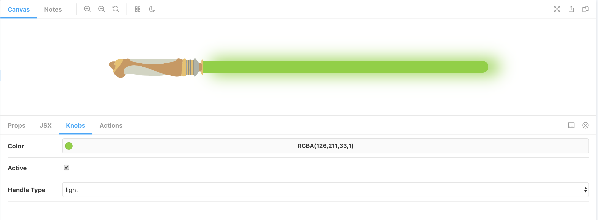

# F2E React + Storybook + Typescript

An example of how to write components in React using Typescript and Storybook.



## Branches

- `start` - The starting point for the challenge
- `solution` - Examples of two different APIs for a lightsaber: 1 top level component + a composable lightsaber with more flexibility

## Getting Started

Run the following commands to get setup:

```sh
# Install Deps
yarn

# Start dev server
yarn storybook
```

After that is done start editing `src/Lightsaber.stories.tsx` and creating your component!

## Challenge

Your task is to build a lightsaber component using that parts included in this repo.

### Components Structure

The following is the way you should put your lightsaber together. A lightsaber body contains a blade and a handle.

```html
<lightsaber-body>
  <lightsaber-handle />
  <lightsaber-blade />
</lightsaber-body>
```

### Included Parts

1. `src/handles.tsx` - An object containing the different handles a lightsaber can have
2. `src/Lightsaber.css` - The only CSS you should need to build your light saber

   - `.body` - the wrapper div for you blade
   - `.blade` - the light emitting portion of the lightsaber
   - `.blade.active` - to be used when the lightsaber blade is visible

3. `src/useLightSaberHum.tsx` - a hook for adding the lightsaber hum to your component

   ```ts
   // Attach this ref to the element you want to hum
   const ref = useLightsaberHum<HTMLDivElement>(active);
   ```

## Tasks

- [ ] Create a `Lightsaber` component
- [ ] Have the color, active state, and handles all be configurable
- [ ] Create an interactive story that uses your component

Bonus:

- [ ] Make it go `woosh` (use the hook!)
